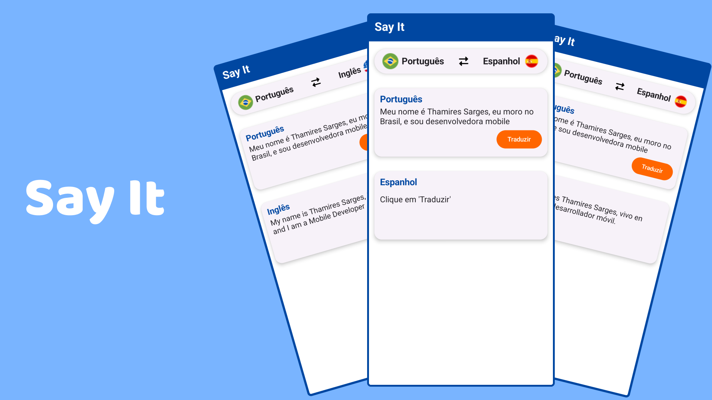
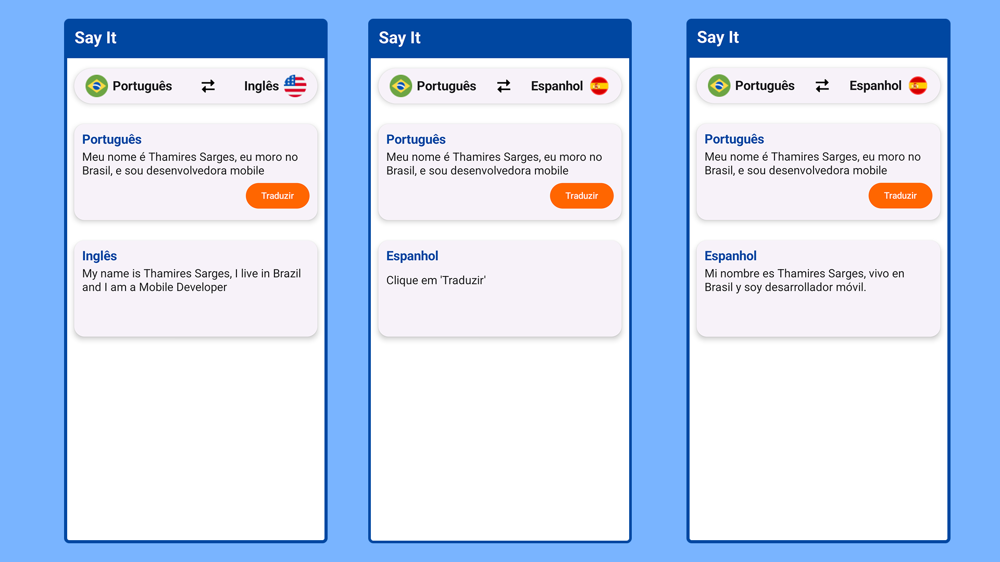

# 🌐📱 Say It – App de Tradução Simples ✨

---

## 📝 Descrição do Projeto
Este é o **Say It**, um aplicativo desenvolvido em **Jetpack Compose** que permite traduzir textos de forma prática e rápida. O usuário pode selecionar idiomas, visualizar traduções e interagir com uma interface moderna, totalmente construída com os conceitos aprendidos no curso **“Jetpack Compose do Zero ao Avançado”**.  

---

## 🌟 Funcionalidades
- 🌎 **Seleção de idiomas** com bandeiras representativas  
- 📝 **Tradução de textos** com atualização de idioma em tempo real  
- 💾 **Persistência de idioma selecionado** usando **DataStore**, para lembrar a preferência do usuário mesmo após fechar o app  
- 📱 **Interface responsiva** e organizada com Cards para exibição de conteúdo  
- 🔄 **Botão de tradução** que altera o idioma do texto de forma dinâmica  
- 🏗️ **Scaffold e TopAppBar** personalizados para melhor experiência do usuário  

---

## 📸 Telas do Aplicativo

